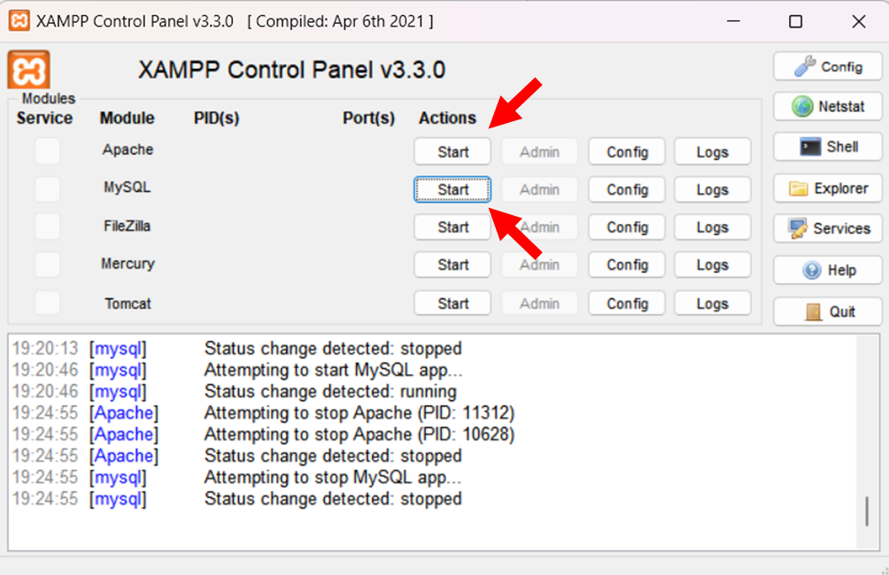
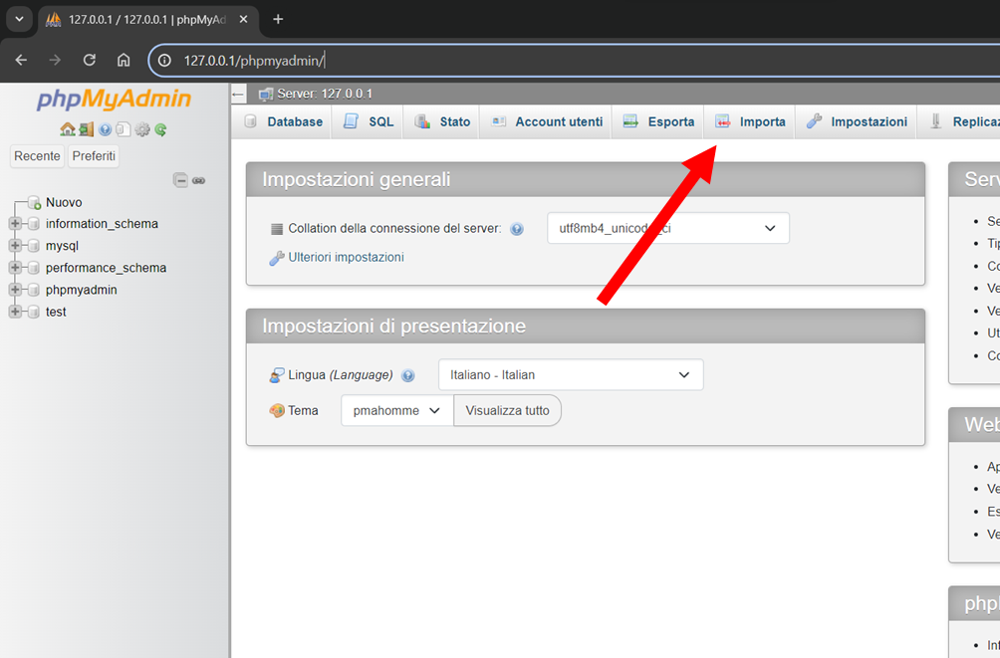
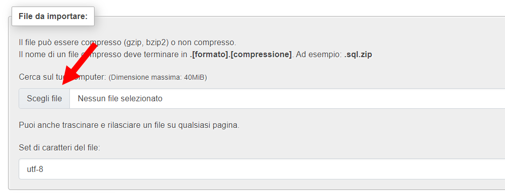
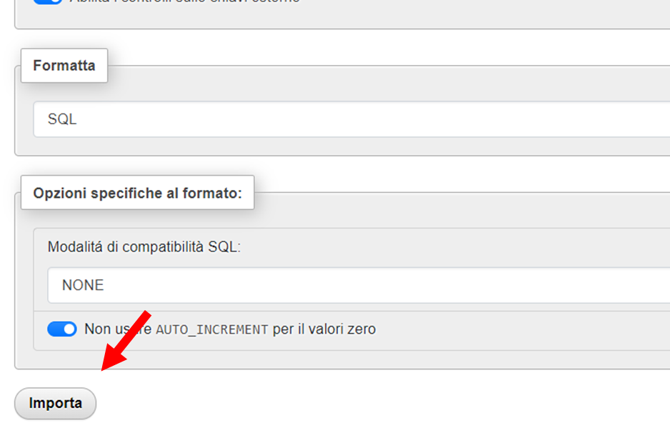
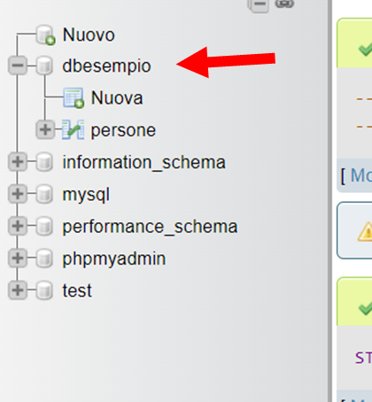
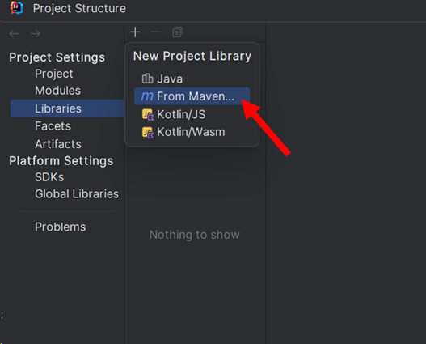
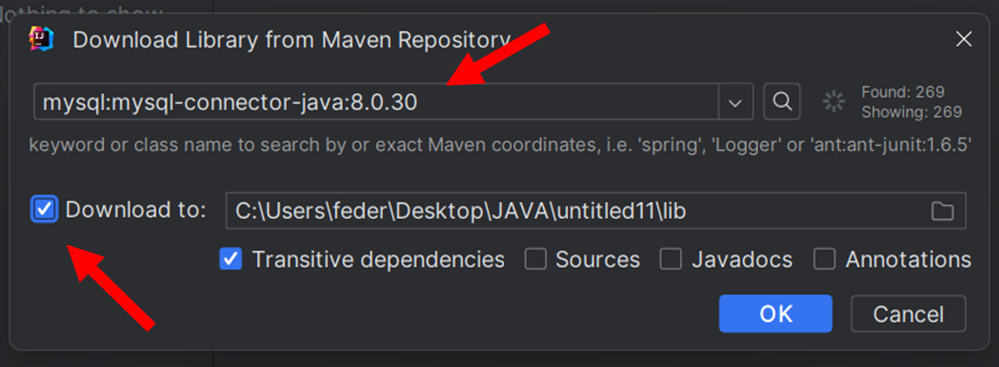

# CRUD-in-Java
The purpose of this project is to  demonstrates a simple MySQL [CRUD (Create, Read, Update, Delete) operation](https://en.wikipedia.org/wiki/Create,_read,_update_and_delete) using Java programming language. The project is specifically geared towards beginner Java developers willing to learn and experiment with database operations.

You can use this repository in two different ways:
1. If you want a quick start to see how a CRUD in java works, simply follow  the [usage section](#usage)

2. If you'd like to write your personal code, firstly [setup the database](#setup-the-database), and then you have to [setup project from IDE](#setup-the-ide) - this project was developed with IntelliJ</br>


## Usage

### Setup the database
1. Download and install XAMPP</br>
   </br>
2. Start Apache and MySQL modules</br>
   </br>
   </br>
   </br>
3. Open the phpmyadmin interface, pressing config on MySQL method or searching [127.0.0.1/phpmyadmin](http://127.0.0.1/phpmyadmin) </br>
   </br>
4. Download the [SQL file](database/dbesempio.sql) and import it in the phpmyadmin interface</br>
   </br>

   *Select Import on the interface*</br>
   </br>
   *Select the .sql file to import*</br>
   </br>
   *Execute the import*</br>
   </br>
*Database is created*</br>
   </br>

### Clone the repository
In command prompt move to the directory you'd like to have the project and use the command `git clone` for this repository
</br>
   ```bash
   git clone https://github.com/federicomaniglio/CRUD-in-Java.git
   ```
Open the project in your IDE (IntelliJ IDEA is preferred) and press start. The required dependencies are included in the lib folder.</br>
If you have issues with the dependencies:
1. click 'File' -> 'Project Structure' -> 'Project Settings' -> 'Libraries'.
2. In Libraries, click on the '+' button to add the libraries and then navigate to the 'lib' folder of the project.
3. Select all jar files in the lib folder and click 'OK' to add the libraries to the project.

## Tutorial: Do it by yourself
Follow the instructions below to write your code from blank using the [SQL file](database/dbesempio.sql) given in this repository
</br></br>Start doing the [setup of the database](#setup-the-database)

### Setup the IDE
This project was developed with IntelliJ IDEA. To set up the project in your IDE, do as follows:

1. Open IntelliJ IDEA.
2. Click on 'File' -> 'New' -> 'Project' and create a project with your preferred JDK (21 is suggestd).
3. Add the dependecies libraries 'File' -> 'Project Structure' -> 'Project Settings' -> 'Libraries' -> '+' -> 'From Maeven...'</br>
   </br>
</br></br>
4. Search for the library `mysql:mysql-connector-java:8.0.30` and select _"Download to:"_ to save the JAR file of the library in the lib folder</br></br> 
   </br></br>

## The code explained

For a good use of the java language is a good thing using a class to manage the comunications with the database
</br>
### Attributes
*Represents a connection to a database. The conn variable is used to establish a connection to a database and execute SQL queries. Methods in the DB class utilize the conn variable to execute queries such as SELECT, INSERT, UPDATE, and DELETE. This variable should be initialized with a valid Connection object before using any of the database-related methods.*
```java
private Connection conn;
```

</br></br>
### Constructor
*Represents a connection to a database.*
```java
public DB(String address, String port, String databaseName, String username, String password) {
        //stringa di connessione -> jdbc:mysql://127.0.0.1:3306/nomeDB
        String dbConnectionString = "jdbc:mysql://" + address + ":" + port + "/" + databaseName;
        try {
            conn = DriverManager.getConnection(dbConnectionString, username, password);
            if (conn != null)
                System.out.println("connessione avvenuta");
        } catch (SQLException e) {
            e.printStackTrace();
        }

    }
```
</br></br>
### Methods
#### Select
*Executes a SELECT query on the database*
```java
 public String select(String what, String from, String where, String is) {
   String result = "";
   try {
      if (!conn.isValid(5)) {
         return null;
      }
   } catch (SQLException e) {
      e.printStackTrace();
      return null;
   }
   String query = "SELECT " + what + " FROM " + from + " WHERE " + where + " = ?";

   try {
      PreparedStatement statement = conn.prepareStatement(query);
      statement.setString(1, is);
      ResultSet rs = statement.executeQuery();
      while (rs.next()) {
         for (int i = 1; i <= rs.getMetaData().getColumnCount(); i++) {
            result += rs.getString(i) + "\t";
            if (rs.getString(i).length() < 8) result += "\t";
         }
         result += "\n";
      }
   } catch (SQLException e) {
      e.printStackTrace();
      return null;
   }
   return result;
}
```
</br></br>
#### Select all
*Executes a SELECT query on the database to retrieve all records from a specified table*
```java
public String selectALL(String from) {
   String result = "";
   try {
      if (!conn.isValid(5)) {
         return null;
      }
   } catch (SQLException e) {
      e.printStackTrace();
   }
   String query = "SELECT * FROM " + from;

   try {
      PreparedStatement statement = conn.prepareStatement(query);
      ResultSet rs = statement.executeQuery();
      while (rs.next()) {
         for (int i = 1; i <= rs.getMetaData().getColumnCount(); i++) {
            result += rs.getString(i) + "\t";
            //if the record is too short this if add a new tabulation
            if (rs.getString(i).length() < 8) result += "\t";
         }
         result += "\n";
      }
   } catch (SQLException e) {
      e.printStackTrace();
   }


   return result;
}
```
</br></br>
#### Insert
*Inserts a new record into the "persone" table in the database*
```java
public boolean insertIntoPersone(String nome, String cognome, int eta, String sesso) {
   try {
      if (!conn.isValid(5)) {
         return false;
      }
   } catch (SQLException e) {
      e.printStackTrace();
      return false;
   }
   String query = "INSERT INTO persone (nome, cognome, eta, sesso) VALUES (?, ?, ?, ?)";
   try {
      PreparedStatement statement = conn.prepareStatement(query);
      statement.setString(1, nome);
      statement.setString(2, cognome);
      statement.setInt(3, eta);
      statement.setString(4, sesso);
      statement.executeUpdate();
   } catch (SQLException e) {
      e.printStackTrace();
      return false;
   }
   return true;
}
```
</br></br>
#### Update
*Updates a record in the "persone" table in the database with the specified ID*
```java
public boolean updateIntoPersonabyID(int id, String nome, String cognome, Integer eta, String sesso) {
   try {
      if (!conn.isValid(5)) {
         return false;
      }
   } catch (SQLException e) {
      e.printStackTrace();
      return false;
   }
   String query = "UPDATE persone SET nome = ?, Cognome = ?, eta = ?, Sesso = ? WHERE ID = ?";
   try {
      PreparedStatement statement = conn.prepareStatement(query);
      statement.setString(1, nome);
      statement.setString(2, cognome);
      statement.setInt(3, eta);
      statement.setString(4, sesso);
      statement.setInt(5, id);
      statement.executeUpdate();
   } catch (SQLException e) {
      e.printStackTrace();
      return false;
   }
   return true;
}
```
</br></br>
#### Delete
*Deletes a record from the "persone" table in the database by name*
```java
public boolean deleteIntoPersoneByName(String nome) {
   try {
      if (!conn.isValid(5)) {
         return false;
      }
   } catch (SQLException e) {
      e.printStackTrace();
      return false;
   }
   String query = "DELETE FROM persone WHERE Nome = ?";
   try {
      PreparedStatement statement = conn.prepareStatement(query);
      statement.setString(1, nome);
      statement.executeUpdate();
   } catch (SQLException e) {
      e.printStackTrace();
      return false;
   }
   return true;
}
```

</br></br>
### Main
*This is a example of a main to test the class DB*
```java
 public static void main(String[] args) {
   DB database = new DB("127.0.0.1", "3306", "dbesempio", "root", "");
   System.out.println(database.selectALL("persone"));
   if (database.insertIntoPersone("Marco", "Rossi", 18, "m")) {
      System.out.println(database.selectALL("persone"));
   } else {
      System.out.println("Inserimento non avvenuto!");
   }
   System.out.println();
   if (database.updateIntoPersonabyID(7, "Mario", "Bianchi", 19, "m")) {
      System.out.println(database.selectALL("persone"));
   } else {
      System.out.println("Aggiornamento non avvenuto!");
   }
   System.out.println();
   if (database.deleteIntoPersoneByName("Mario")) {
      System.out.println(database.selectALL("persone"));
   } else {
      System.out.println("Eliminazine non avvenuta!");
   }
}
```
</br></br>
## Contributing
Issues, PRs, and all your suggestions and discussions are very welcome!

## License
This project is licensed under the MIT License - see the [LICENSE.md](LICENSE) file for details